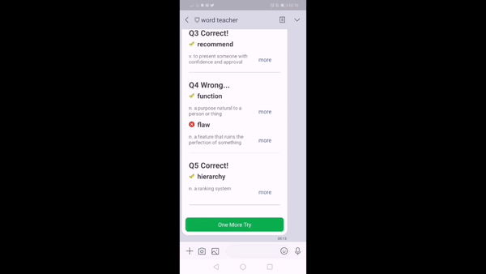
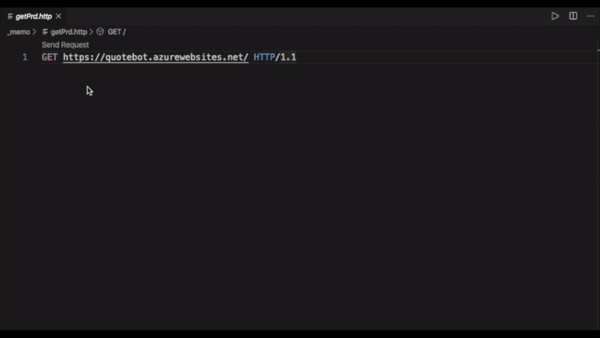

個人で開発してきたプロジェクトを紹介します。
/ This page is to introduce my individual projects.

## Word Teacher (LINE BOT)
Word TeacherというLINE Botです。英単語のクイズとその採点をしてくれます。  
/ Word Teacher is a LINE bot. It teaches you english words by quizzes and scoring.
(LINE is the most used messanger app in Japan.)  

### Related Technology
+ Spring Boot (Java Framework)
+ LINE Bot SDK [(Link)](https://github.com/line/line-bot-sdk-java)
+ REST API
+ Heroku (PaaS)
+ PostgreSQL@Heroku (DB)

### More Info
関連記事です。  
/ There are articles about Word Teacher.(Japanese Only)  

[Spring BootでLINE Botのサンプルを動かす 〜おうむ返しのその先へ〜](/tech-memo/2020/04/2020-0408-linebot/)
[LINE BotでFlex Messageを使う (with Spring Boot)](/tech-memo/2020/04/2020-0415-flexMessage/)

## Quote API
Quote APIはプログラマによるプログラマのための名言を取得できるAPIです。  
/ Quote API is an API from which you can get quotes by programmers, for programmers.

### Related Technology
+ Spring Boot
+ REST API
+ Azure App Service (PaaS)
+ Cosmos DB (NoSQL by Azure)

### More Info
関連記事です。  
/ There are articles about Word Teacher. (Japanese Only)  

[Spring Boot + Azure App Engine +Cosmos DBでAPIを無料で爆速開発する - その１](/tech-memo/2020/04/2020-0430-springboot-azure-1/)
[Spring Boot + Azure App Engine +Cosmos DBでAPIを無料で爆速開発する - その２](/tech-memo/2020/04/2020-0430-springboot-azure-2/)

## Tech Blog
個人開発で学んだことをブログとしてアウトプットしています。  
/ I have this blog to output what I've learnt.

### Related Technology
+ Hexo (Static Site Generater)
+ GitHub Pages (Hosting)